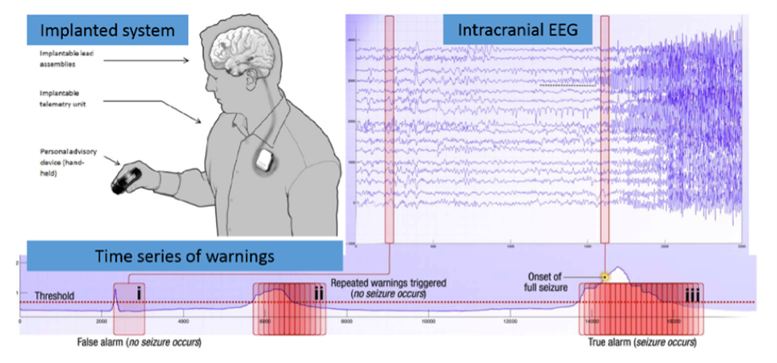
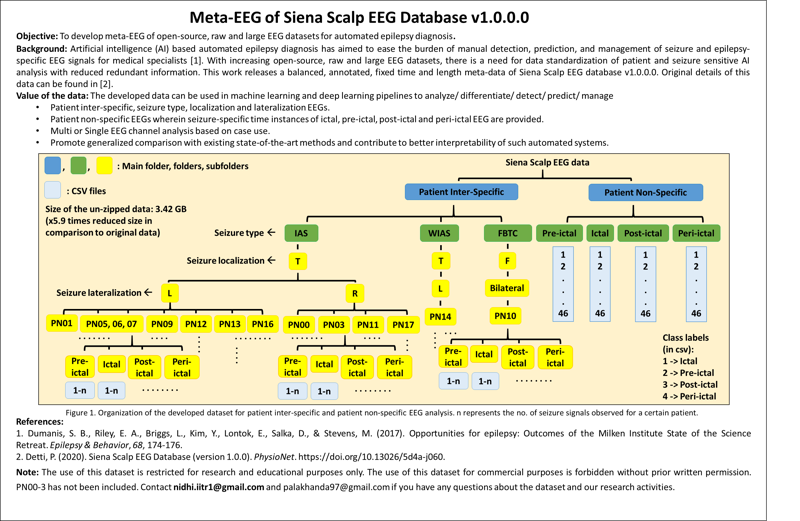

# NeuroGuard


ML-Based Seizure Prognosis and Prevention via Transcutaneous Auricular Vagus Nerve Stimulation

## Tutorial Video
Watch this YouTube video for a tutorial and overview explanation of the data analysis:

[NeuroGuard Tutorial](https://youtu.be/mP3sNSmnhqA)


## Abstract:
Epilepsy affects approximately 1% of the global population, presenting a significant healthcare challenge characterized by spontaneous and unpredictable seizures. This proposal outlines a machine learning (ML) model for the prediction and prevention of epileptic seizures. The model leverages the temporal dynamics of EEG data to forecast seizures and employs transcutaneous auricular vagus nerve stimulation (ta-VNS) as a responsive neuromodulation technique. The closed-loop control system aims to identify preictal states and apply ta-VNS to avert potential seizures, improving the quality of life for patients with epilepsy.
Introduction:
The unpredictable nature of epileptic seizures imposes severe limitations on the daily lives of patients. The integration of seizure forecasting systems with responsive neurostimulation presents a compelling solution. We propose an ML-based approach for seizure prediction, coupled with ta-VNS for seizure prevention. This closed-loop system will utilize real-time EEG data, process it through a computational algorithm to detect preictal brain states, and trigger ta-VNS to prevent the seizure.
 
 

## Objectives:
•	To develop an ML model capable of identifying the preictal state with high accuracy.
•	To integrate the ML model with a closed-loop control system for real-time EEG data analysis.
•	To use ta-VNS as a non-invasive intervention to prevent predicted seizures.

## Methods:
1.	Data Acquisition: 
    - Collect and curate EEG data from patients with naturally occurring epilepsy, categorizing it into interictal, preictal, ictal, and postictal states. we will expermint with [Siena Scalp EEG Database](https://www.physionet.org/content/siena-scalp-eeg/1.0.0/).
        ```bash
        wget -r -N -c -np https://physionet.org/files/siena-scalp-eeg/1.0.0/
        ```
    - Meta-EEG of Siena Scalp EEG Database v1.0.0
    
     [Muskan Gupta, Rishita Anand Sachdeva, Esha Gupta, Palak Handa, & Nidhi Goel. (2022). Meta-EEG of Siena Scalp EEG Database v1.0.0 [Data set]. Zenodo. https://doi.org/10.5281/zenodo.6061290]

2.	Feature Engineering: 
    - Extract relevant features from EEG signals that discriminate between preictal and other states using Cepstral Analysis.

3.	Model Development:
    - Employ various ML algorithms (e.g., SVM, Random Forest, LSTM networks) to classify the brain states.
    - Validate the model using k-fold cross-validation to ensure robustness.
    - Optimize the model using precision-recall metrics to prioritize correct preictal detections.

4.	Closed-Loop Control System Design:
    -	Implement a real-time monitoring system to process EEG data continuously.
    -	Develop a triggering mechanism for ta-VNS upon detecting a preictal state.
    -   Ensure the safety of the system with manual override capabilities and emergency shutdown features.

5.	ta-VNS Device Integration:
    -   Integrate the ML model with a ta-VNS device, ensuring latency is minimized.
    - Calibrate the stimulation parameters for optimal patient response.

6.	Clinical Trial:
    - Conduct a randomized controlled trial with an active stimulation group and a control group.
    - Assess the efficacy of the closed-loop system in reducing seizure frequency and improving quality of life.

7.	Evaluation:
    - Analyze seizure diaries for a reduction in seizure frequency.
    - Evaluate quality of life, anxiety, and depression scales before and after intervention.
    -   Record and assess adverse events related to ta-VNS.

## Potential Challenges and Solutions:
    - Differentiating Preictal and Interictal States: Advanced deep learning techniques, like convolutional neural networks (CNNs) and recurrent neural networks (RNNs), will be explored to improve differentiation.
    - Latency in the Closed-Loop System: The system will be designed for minimal processing time, and the ML model will be optimized for speed without compromising accuracy.
    - Patient Safety: Continuous monitoring and stringent safety protocols will be established to mitigate risks associated with ta-VNS.

## Conclusion:
This project aims to create a transformative solution for epilepsy management. By integrating cutting-edge ML techniques with non-invasive neurostimulation, we endeavor to provide patients with a proactive tool to manage their condition, ultimately enhancing their autonomy and quality of life.

The envisioned ML-driven seizure forecasting system with responsive ta-VNS therapy could mark a significant milestone in personalized epilepsy management, offering a novel approach to improve the lives of those affected by this challenging neurological condition.


## Getting Started

These instructions will get you a copy of the project up and running on your local machine for development and testing purposes.

### Prerequisites

You need to have Anaconda distribution installed to create virtual environments and manage packages. You can download it from [here](https://www.anaconda.com/products/distribution).

### Setting Up

1. **Clone the repository**

    Open your terminal and clone this repository by running:

    ```bash
    git clone https://github.com/Sayeh-1337/NeuroGuard.git
    ```

2. **Create a Conda virtual environment**

    Navigate into the cloned project directory and create a new Conda environment by running:

    ```bash
    cd NeuroGuard
    conda create --name env_name python=3.x
    ```

    Replace `env_name` with your preferred name for the virtual environment, and `3.x` with your preferred Python version (e.g., `3.7`).

3. **Activate the virtual environment**

    Activate the created virtual environment by running:

    ```bash
    conda activate env_name
    ```

    Replace `env_name` with the name of the virtual environment you created.

4. **Install required packages**

    Install the required packages by running:

    ```bash
    conda install pandas numpy matplotlib seaborn scikit-learn plotly scipy sweetviz librosa
    ```
    ```bash
    conda install --channel=conda-forge --name=base conda-libmamba-solver
    pip install mne
    ```
5. **Launch Jupyter Notebook**

    Start Jupyter Notebook by running:

    ```bash
    jupyter notebook
    ```

    This will open a new tab in your web browser where you can navigate to the notebook file (`*.ipynb`) and open it.

    > **Note:**  for ML and DNN models, can be created using (`DNN-experiment.ipynb`) and (`simulation-experiment.ipynb`) notebooks.

## Running the Notebook

Follow the instructions in the notebook to run the cells and perform the analysis.

> **Note:**  for DNN models, you need to install tensorflow and keras libraries. and to run the code you on  a GPU. you need to install CUDA and cuDNN libraries which is compatible with tensorflow version you are using.

## Streamlit App

You can also run the Streamlit app to simulate and show the results. To do so, follow these steps:

1. **Install Streamlit**

    Install Streamlit by running:

    ```bash
    pip install streamlit
    ```
    or 
    ```bash
    conda install -c conda-forge streamlit
    ```
2. **Run the Streamlit app**
    
    Navigate to the project directory and run the Streamlit app by running:
    
    ```bash
    streamlit run app.py
    ```
    

    you will enter the EEG data and the app will predict the state of the brain and the probability of the seizure [pre-ictal, ictal, post-ictal, normal].

    the simulation of streaming the EEG data by sampling 10 sec of data and predict the state of the brain and the probability of the seizure [pre-ictal, ictal, post-ictal, normal]. you should define time cropping fo the input Data which will be sampled for each 10 sec. 

    also you can select between different models to predict the state of the brain and the probability of the seizure [pre-ictal, ictal, post-ictal, normal]. [SVM, Random Forest, Balanced Random Forest, AdaBoost, XGBoost, CNN]
    

## Built With

* Python
* Jupyter Notebook
* Pandas
* Numpy
* Matplotlib
* Seaborn
* Scikit-Learn
* Plotly
* SciPy
* Sweetviz
* Librosa
* MNE

## Authors

* **Sayeh-1337**
